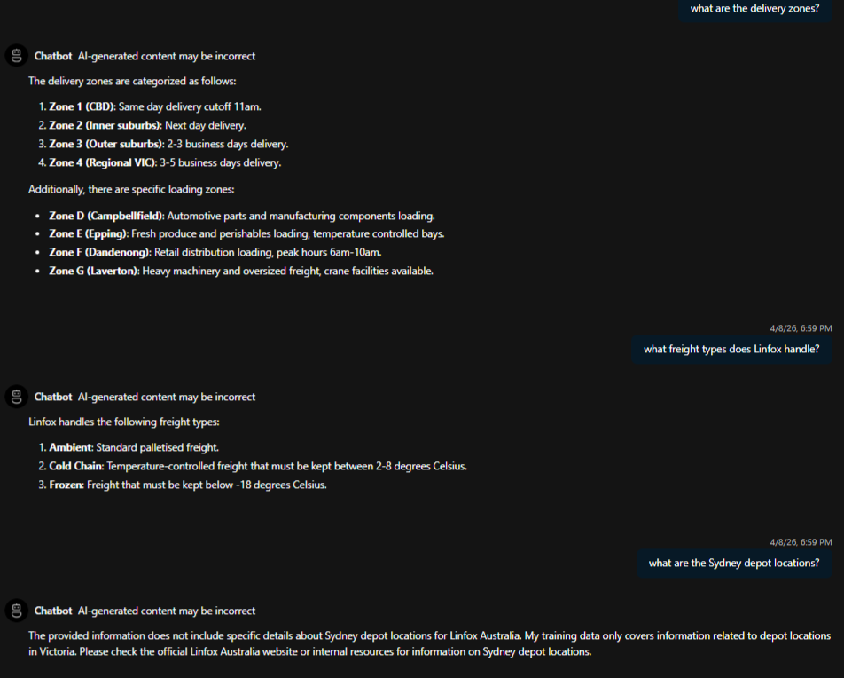

# ai-chat-foundry-poc

A domain-specific RAG chatbot built on Azure AI Foundry, customised for Melbourne logistics operations using Linfox Australia as the domain. Forked from [Azure-Samples/get-started-with-ai-chat](https://github.com/Azure-Samples/get-started-with-ai-chat) and extended with custom data ingestion, infrastructure fixes and systematic behaviour analysis.

Built as a portfolio project to demonstrate practical RAG development skills and investigate real RAG behaviour in a production-like environment.

---

## The Most Important Part of This Project

If you read one thing, read this:

### [RAG Behaviour Analysis Report](docs/rag-analysis.md)

This report documents 8 findings from systematic testing of the chatbot covering chunking failures, vector proximity, conversation history behaviour, prompt engineering and security vulnerabilities. Each finding was discovered through real testing, not theory.

It includes a structured investigation where GPT was temporarily asked to self-report exactly what it used to answer each question, turning a black box into a transparent debugging exercise. It documents how a user can inject false information into the system, how GPT carries it forward as fact, and why realistic-sounding injections are more dangerous than obvious ones.

This is the centrepiece of the project. The code is the vehicle. The analysis is the work.

---

## Chatbot in Action

Three questions tested in the same session showing real behaviour, not a sanitised demo:

<div align="center"><a href="docs/images/rag_analysis/chatbot_screenshot.png"></a></div>

1. "What are the delivery zones?": correct delivery zones returned, but loading zones also bled in due to shared suburb names. Documented in [Part 2 of the analysis](docs/rag-analysis.md#part-2-naming-convention-testing).
2. "What freight types does Linfox handle?": 3 of 4 returned with full confidence. Dangerous goods missing due to a chunking boundary. No error signal to the user. Documented in [Part 1](docs/rag-analysis.md#part-1-initial-testing-original-dataset-no-loading-zones).
3. "What are the Sydney depot locations?": clean out of scope handling. GPT correctly stayed within Melbourne operations without being explicitly instructed to.

---

## What This Project Demonstrates

- Building and deploying a domain-specific RAG chatbot on Azure AI Foundry
- Writing a custom Python embedding pipeline (`scripts/build_embeddings.py`) to ingest domain-specific data for RAG and semantic search
- Identifying and fixing a blocking upstream bug that prevented the app from loading
- Systematic investigation of RAG behaviour across 6 parts and 8 findings
- Identifying prompt security vulnerabilities including information injection through real testing
- Documenting findings clearly enough to present in a technical interview

---

## Tech Stack

| Component | Technology |
|---|---|
| AI Model | GPT-4o-mini (Azure AI Foundry) |
| Embeddings | text-embedding-3-small (100 dimensions) |
| Vector Search | Azure AI Search |
| Backend | Python, Gunicorn, Azure Container Apps |
| Frontend | React (Microsoft template) |
| Infrastructure | Azure Bicep, Azure Developer CLI (azd) |
| Data pipeline | Custom Python (`scripts/build_embeddings.py`) |

---

## Architecture


The system follows a standard RAG pattern: source text is split into 4-sentence chunks, each chunk embedded into a 100-dimensional vector, stored in Azure AI Search, and retrieved by similarity when a user asks a question. The top 5 chunks are injected into the GPT-4o-mini system prompt alongside conversation history.

Full architecture details and behaviour findings are documented in the [RAG Analysis Report](docs/rag-analysis.md).

---

## Custom Embedding Pipeline

The Microsoft template includes a built-in embedding process for its own sample documents. To ingest custom domain data (Linfox Melbourne logistics), a reusable Python script was built:

```
scripts/build_embeddings.py
```

This script:
- Reads `.txt` files from `src/static/data/`
- Generates embeddings using `text-embedding-3-small`
- Saves `embeddings.csv` to `src/api/data/`
- Deletes the existing Azure Search index so it is recreated fresh on next deploy

Built as a standalone reusable script rather than a one-time CLI command so the pipeline can be re-run whenever the knowledge base is updated or the embedding model changes, without manual steps.

---

## Domain Data

Linfox Australia Melbourne logistics operations including depot locations, delivery zones, freight types (including ADG dangerous goods compliance), common delay reasons, driver shift times, escalation process and loading zones added for testing purposes.

Source: `src/static/data/melbourne-logistics.txt`

---

## Project Structure

```
ai-chat-foundry-poc/
├── docs/
│   ├── rag-analysis.md              # RAG behaviour analysis report (read this)
│   └── images/rag_analysis/         # Screenshots and diagrams from testing
├── scripts/
│   └── build_embeddings.py          # Custom embedding generation pipeline
├── src/
│   ├── api/
│   │   ├── data/                    # embeddings.csv (auto-generated)
│   │   └── routes.py                # RAG search and GPT integration
│   └── static/data/
│       └── melbourne-logistics.txt  # Domain knowledge base
└── infra/
    └── main.bicep                   # Azure infrastructure
```

---

## Try It

The app is not permanently deployed due to Azure running costs. Two options:

**Request a demo:** Reach out via GitHub and a live session can be arranged in a short window.

**Deploy yourself:** Follow the steps below. Deployment takes around 25 minutes.

---

## Deploy

### Prerequisites

- Python 3.10+
- Azure Developer CLI (`azd`)
- Azure subscription
- Node.js 18+

### Steps

```powershell
# Clone
git clone https://github.com/deesk/ai-chat-foundry-poc.git
cd ai-chat-foundry-poc

# Virtual environment
python -m venv .venv
.venv\Scripts\activate

# Install dependencies
pip install -r src/api/requirements.txt

# Build embeddings (run whenever knowledge base changes)
python scripts/build_embeddings.py

# Deploy to Azure
azd up

# Shutdown when done (prevents unnecessary charges)
azd down --purge
```

---

## Cost Analysis
 
Total project cost: AU$2.59 across 16 active development days.
Infrastructure accounted for 98% of spend. AI API calls (GPT-4o-mini + embeddings) accounted for 2%.
 
See the full [Cost Analysis](docs/cost-analysis.md) for service breakdown, key observations and production considerations.

---

## Upstream Bug Fix

A blocking bug was identified and fixed in this fork from the upstream Microsoft template.

**Internal Server Error on first load** ([Issue #129](https://github.com/Azure-Samples/get-started-with-ai-chat/issues/129))

After a successful `azd up` deployment, the app returned an Internal Server Error on every page load immediately. The root cause was a `TemplateResponse` syntax in `src/api/routes.py` incompatible with the current Starlette version on Python 3.13.

Fixed by updating the argument format:

```python
# Before (broken)
return templates.TemplateResponse(
    "index.html",
    {"request": request}
)

# After (fixed)
return templates.TemplateResponse(
    request=request,
    name="index.html"
)
```

---

## Certifications

- Microsoft Azure Fundamentals (AZ-900)
- Microsoft Azure AI Fundamentals (AI-900)
- Microsoft Azure AI Engineer Associate (AI-102)

---

## Author

Sandesh | [GitHub: deesk](https://github.com/deesk)

Melbourne, Australia.

---

*This project is a portfolio proof of concept. It is not affiliated with or endorsed by Linfox Australia.*