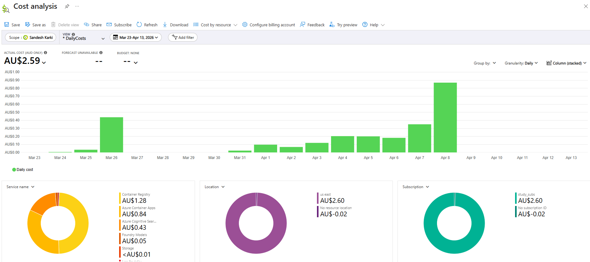

# Cost Analysis Report

Total project cost: **AU$2.59** across 16 active development days (Mar 24 to Apr 8, 2026).
Average active usage approximately 2-3 hours per day with resources torn down at end of each session.

---

## Service Breakdown

| Service | % of Spend | Billing Type |
|---|---|---|
| Container Registry | 49% | Provisioned (flat daily rate) |
| Azure Container Apps | 32% | Hybrid (compute + consumption) |
| Azure Cognitive Search | 17% | Provisioned (flat daily rate) |
| Foundry Models (GPT-4o-mini + embeddings) | 2% | Consumption (per token) |
| Storage + Log Analytics | <1% | Consumption |

<em> <> Daily cost by service from first deployment to full teardown </b></em>

---

## The Core Insight

**Infrastructure accounted for 98% of spend. AI API calls accounted for 2%.**

This ratio is specific to POC scale with minimal usage (approximately 50 chat queries
and 12-15 embedding runs across the full investigation period). It does not hold at
production scale.

Embedding model was re-run 12-15 times during testing, a mix of full document
re-embeddings and partial runs as naming conventions were changed (numeric to alphabetic
and back) to investigate vector proximity contamination between delivery and loading zones.
Despite multiple full and partial runs, token cost remained negligible due to small dataset
size, confirming embedding cost scales with corpus size not regeneration frequency.

As query volume grows, infrastructure costs remain relatively stable while AI API costs
scale directly with usage. The ratio flips. At high query volumes, Foundry Models becomes
the dominant cost, not infrastructure.

This creates two questions every Azure AI solution must answer before production:

- What is the minimum monthly cost just to keep it running regardless of usage?
- What happens to cost when query volume doubles?

The first question is answered by provisioned services. The second by consumption services.
Understanding which services fall into which category is the foundation of Azure AI cost planning.

---

## Key Observations

**Provisioned services bill to exist, not to be used.**
Container Registry and Azure Cognitive Search charge a flat daily rate regardless of
query volume. Idle overnight costs the same as a full day of active testing.

**`azd down --purge` is the correct teardown command.**
The `--purge` flag permanently deallocates soft-deleted resources. Cost Analysis
confirmed AU$0.00 from Apr 9 onwards after purge confirming complete deallocation.

**Azure billing has a 1-3 day reporting lag.**
Verify deallocation using daily granularity view in Cost Analysis, not the
accumulated cost curve which can appear to continue after resources are deleted.

**Monitor costs daily during development.**
Cost Analysis was checked daily throughout this project to catch unexpected charges
early. In production, manual monitoring does not scale. Budget Alerts should be
configured at 80% and 100% of monthly budget before any live deployment.

---

## What I Would Do Differently in Production

- Configure Budget Alerts at 80% and 100% of monthly budget before go-live
- Set Container Apps `minReplicas: 0` to eliminate idle compute cost during low traffic periods
- Use Azure Cognitive Search Free tier for development environments
- Tag all resources by environment and project for accurate cost attribution
- Model production costs using the [Azure Pricing Calculator](https://azure.microsoft.com/en-au/pricing/calculator/) with actual usage targets before committing to a tier